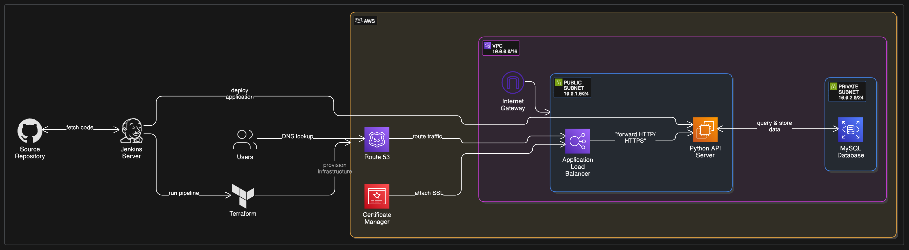
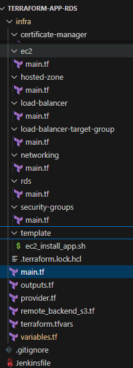
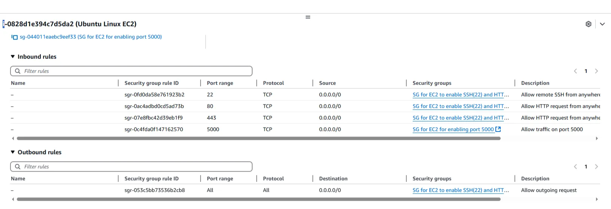

# Terraform App Deployment on AWS

**This setup supports a 2-tier architecture where:**

- **The frontend [flask app] (EC2) is placed in public subnets**
- **The backend  ( RDS) is placed in private subnets**
- Repos : https://github.com/AhmedSamy1999/aws-terraform-jenkins-app-deployment https://github.com/AhmedSamy1999/python-mysql-db



## Terraform File Structure



## variables.tf

```python
variable "bucket_name" {
  type        = string
  description = "Remote state bucket name"
}

variable "name" {
  type        = string
  description = "Tag name"
}

variable "environment" {
  type        = string
  description = "Environment name"
}

variable "vpc_cidr" {
  type        = string
  description = "Public Subnet CIDR values"
}

variable "vpc_name" {
  type        = string
  description = " VPC 1"
}

variable "cidr_public_subnet" {
  type        = list(string)
  description = "Public Subnet CIDR values"
}

variable "cidr_private_subnet" {
  type        = list(string)
  description = "Private Subnet CIDR values"
}

variable "eu_availability_zone" {
  type        = list(string)
  description = "Availability Zones"
}

variable "public_key" {
  type        = string
  description = " Public key for EC2 instance"
}

variable "ec2_ami_id" {
  type        = string
  description = " AMI Id for EC2 instance"
}

variable "ec2_user_data_install_app" {
  type = string
  description = "Script for installing the App"
}

variable "domain_name" {
  type = string
  description = "Name of the domain"
}

```

## terraform.tfvars

```python
bucket_name = "my-terraform-state-bucket-samy-eu-central-1-app-rds"
name        = "environment"
environment = "dev-1"

vpc_cidr             = "10.0.0.0/16"
vpc_name             = "dev-proj-eu-central-vpc-1"
cidr_public_subnet   = ["10.0.1.0/24", "10.0.2.0/24"]
cidr_private_subnet  = ["10.0.3.0/24", "10.0.4.0/24"]
eu_availability_zone = ["eu-central-1a", "eu-central-1b"]

public_key = "ssh-ed25519 AAAAC3NzaC1lZDI1NTE5AAAAIHwSg3kTQFUoKTk4C3kR8lNhCt9TCYQdhnB12CJXZbIU ahmed@DESKTOP-J8RD4LD"
ec2_ami_id     = "ami-03250b0e01c28d196"

ec2_user_data_install_app = ""

domain_name = "zyhosttest.online"

```

## main.tf

```python

module "networking" {
  source               = "./networking"
  vpc_cidr             = var.vpc_cidr
  vpc_name             = var.vpc_name
  cidr_public_subnet   = var.cidr_public_subnet
  eu_availability_zone = var.eu_availability_zone
  cidr_private_subnet  = var.cidr_private_subnet
}

module "security_group" {
  source                     = "./security-groups"
  ec2_sg_name                = "SG for EC2 to enable SSH(22) and HTTP(80)"
  vpc_id                     = module.networking.dev_proj_1_vpc_id
  public_subnet_cidr_block   = tolist(module.networking.public_subnet_cidr_block)
  ec2_sg_name_for_python_api = "SG for EC2 for enabling port 5000"
}

module "ec2" {
  source                   = "./ec2"
  ami_id                   = var.ec2_ami_id
  instance_type            = "t2.micro"
  tag_name                 = "Ubuntu Linux EC2"
  public_key               = var.public_key
  subnet_id                = tolist(module.networking.dev_proj_1_public_subnets)[0]
  sg_enable_ssh_https      = module.security_group.sg_ec2_sg_ssh_http_id
  ec2_sg_name_for_python_api     = module.security_group.sg_ec2_for_python_api
  enable_public_ip_address = true
  rds_endpoint = local.rds_endpoint
  user_data_install_app = templatefile("./template/ec2_install_app.sh", {
    rds_endpoint = local.rds_endpoint
  })
}

module "lb_target_group" {
  source                   = "./load-balancer-target-group"
  lb_target_group_name     = "dev-proj-1-lb-target-group"
  lb_target_group_port     = 5000
  lb_target_group_protocol = "HTTP"
  vpc_id                   = module.networking.dev_proj_1_vpc_id
  ec2_instance_id          = module.ec2.dev_proj_1_ec2_instance_id
}

module "alb" {
  source                    = "./load-balancer"
  lb_name                   = "dev-proj-1-alb"
  is_external               = false
  lb_type                   = "application"
  sg_enable_ssh_https       = module.security_group.sg_ec2_sg_ssh_http_id
  subnet_ids                = tolist(module.networking.dev_proj_1_public_subnets)
  tag_name                  = "dev-proj-1-alb"
  lb_target_group_arn       = module.lb_target_group.dev_proj_1_lb_target_group_arn
  ec2_instance_id           = module.ec2.dev_proj_1_ec2_instance_id
  lb_listner_port           = 5000
  lb_listner_protocol       = "HTTP"
  lb_listner_default_action = "forward"
  lb_https_listner_port     = 443
  lb_https_listner_protocol = "HTTPS"
  dev_proj_1_acm_arn        = module.aws_ceritification_manager.dev_proj_1_acm_arn
  lb_target_group_attachment_port = 5000
}

module "hosted_zone" {
  source          = "./hosted-zone"
  domain_name     = var.domain_name
  aws_lb_dns_name = module.alb.aws_lb_dns_name
  aws_lb_zone_id  = module.alb.aws_lb_zone_id
}

module "aws_ceritification_manager" {
  source         = "./certificate-manager"
  domain_name    = var.domain_name
  hosted_zone_id = module.hosted_zone.hosted_zone_id
}

module "rds_db_instance" {
  source               = "./rds"
  db_subnet_group_name = "dev_proj_1_rds_subnet_group"
  subnet_groups        = tolist(module.networking.dev_proj_1_public_subnets)
  rds_mysql_sg_id      = module.security_group.rds_mysql_sg_id
  mysql_db_identifier  = "mydb"
  mysql_username       = "dbuser"
  mysql_password       = "dbpassword"
  mysql_dbname         = "devprojdb"
  
}

locals {
  rds_endpoint = split(":", module.rds_db_instance.rds_endpoint)[0]
}

output "rds_endpoint" {
  value = module.rds_db_instance.rds_endpoint
}

```

# 1. Setting up Terraform state file on s3 backend with object lock and versioning


## -creating folder structure


Files and codes for remote state on s3

1.remote_backend_s3.tf

```python
terraform {
  backend "s3" {
    bucket = "my-terraform-state-bucket-samy-eu-central-1-app-rds"
    key    = "app-rds/terraform.tfstate"
    region = "eu-central-1"
  }
}
```

# 2. Networking Module

---

### Purpose:

Create the networking foundation for all other AWS resources.

### Key Steps:

1. Create a **VPC** with CIDR `10.0.0.0/16`.
2. Create **public subnets** (for EC2 + ALB) across multiple AZs.
3. Create **private subnets** (for RDS) across multiple AZs.
4. Attach an **Internet Gateway** to the VPC.
5. Set up:
    - A **public route table** that routes 0.0.0.0/0 to the Internet Gateway.
    - A **private route table** for internal traffic (no NAT for now).
6. Associate route tables with their corresponding subnets.

### Integrates With:

- EC2 (needs subnet)
- RDS (needs private subnet group)
- Load Balancer (uses public subnets)

---

### VPC Creation

- Create a **Virtual Private Cloud (VPC)** with a CIDR block defined by  ( `10.0.0.0/16`).
    
    ```python
    # Setup VPC
    resource "aws_vpc" "dev_proj_1_vpc_eu_central_1" {
      cidr_block = var.vpc_cidr
      tags = {
        Name = var.vpc_name
      }
    }
    ```
    

---

### Public Subnets

- Create 2 **public subnets** across user-specified availability zones (`eu-central-1a`, `eu-central-1b`) based on a list of public CIDR blocks.

```python
resource "aws_subnet" "dev_proj_1_public_subnets" {
  count             = length(var.cidr_public_subnet)
  vpc_id            = aws_vpc.dev_proj_1_vpc_eu_central_1.id
  cidr_block        = element(var.cidr_public_subnet, count.index)
  availability_zone = element(var.eu_availability_zone, count.index)

  tags = {
    Name = "dev-proj-public-subnet-${count.index + 1}"
  }
}

```

---

### Private Subnets

- Create 2 **private subnets**
- These subnets are intended to host internal-only  RDS database

 

```python
# Setup private subnet
resource "aws_subnet" "dev_proj_1_private_subnets" {
  count             = length(var.cidr_private_subnet)
  vpc_id            = aws_vpc.dev_proj_1_vpc_eu_central_1.id
  cidr_block        = element(var.cidr_private_subnet, count.index)
  availability_zone = element(var.eu_availability_zone, count.index)

  tags = {
    Name = "dev-proj-private-subnet-${count.index + 1}"
  }
}
```

---

### Internet Gateway

- Provision an **Internet Gateway** and attaches it to the VPC for public subnet to access internet.

```python
# Setup Internet Gateway
resource "aws_internet_gateway" "dev_proj_1_public_internet_gateway" {
  vpc_id = aws_vpc.dev_proj_1_vpc_eu_central_1.id
  tags = {
    Name = "dev-proj-1-igw"
  }
}

```

---

### Route Tables and associations

- Create a **public route table** that routes `0.0.0.0/0` (all internet traffic) through the Internet Gateway.
- Associates each public subnet with this route table to enable internet access.
- Creates a **private route table** (currently isolated — no NAT or internet access configured).
- Associates each private subnet with the private route table to enforce private networking.

```python

# Public Route Table
resource "aws_route_table" "dev_proj_1_public_route_table" {
  vpc_id = aws_vpc.dev_proj_1_vpc_eu_central_1.id
  route {
    cidr_block = "0.0.0.0/0"
    gateway_id = aws_internet_gateway.dev_proj_1_public_internet_gateway.id
  }
  tags = {
    Name = "dev-proj-1-public-rt"
  }
}

# Public Route Table and Public Subnet Association
resource "aws_route_table_association" "dev_proj_1_public_rt_subnet_association" {
  count          = length(aws_subnet.dev_proj_1_public_subnets)
  subnet_id      = aws_subnet.dev_proj_1_public_subnets[count.index].id
  route_table_id = aws_route_table.dev_proj_1_public_route_table.id
}

# Private Route Table
resource "aws_route_table" "dev_proj_1_private_subnets" {
  vpc_id = aws_vpc.dev_proj_1_vpc_eu_central_1.id
  #depends_on = [aws_nat_gateway.nat_gateway]
  tags = {
    Name = "dev-proj-1-private-rt"
  }
}

# Private Route Table and private Subnet Association
resource "aws_route_table_association" "dev_proj_1_private_rt_subnet_association" {
  count          = length(aws_subnet.dev_proj_1_private_subnets)
  subnet_id      = aws_subnet.dev_proj_1_private_subnets[count.index].id
  route_table_id = aws_route_table.dev_proj_1_private_subnets.id
}
```


---

---

# 3. Security Groups Module

---

## **Security Groups**

### Purpose:

Define who can connect to your EC2, RDS, and app (Flask API).

### Key Steps:

1. Create SG for EC2:
    - Allows SSH (22), HTTP (80), and HTTPS (443) from anywhere.
2. Create SG for Flask API:
    - Allows port **5000** access from anywhere.
3. Create SG for RDS:
    - Allows MySQL (3306) **only from EC2/public subnet CIDRs**.

### 🔗 Integrates With:

- EC2 instance (attached to both EC2 SGs)
- RDS (attached to allow access only from EC2)

---

### EC2 Security Group – SSH + HTTP + HTTPS

This security group allows the EC2 instance to:

- Be accessed over **SSH (22)** from anywhere
- Serve HTTP (80) and HTTPS (443) requests from the internet
- Access any outbound resources (internet, RDS.)

```hcl
resource "aws_security_group" "ec2_sg_ssh_http" {
  name        = var.ec2_sg_name
  description = "Enable the Port 22(SSH), 80(HTTP), and 443(HTTPS)"
  vpc_id      = var.vpc_id

  ingress {
    description = "Allow SSH from anywhere"
    from_port   = 22
    to_port     = 22
    protocol    = "tcp"
    cidr_blocks = ["0.0.0.0/0"]
  }

  ingress {
    description = "Allow HTTP from anywhere"
    from_port   = 80
    to_port     = 80
    protocol    = "tcp"
    cidr_blocks = ["0.0.0.0/0"]
  }

  ingress {
    description = "Allow HTTPS from anywhere"
    from_port   = 443
    to_port     = 443
    protocol    = "tcp"
    cidr_blocks = ["0.0.0.0/0"]
  }

  egress {
    description = "Allow all outbound traffic"
    from_port   = 0
    to_port     = 0
    protocol    = "-1"
    cidr_blocks = ["0.0.0.0/0"]
  }

  tags = {
    Name = "Security Groups to allow SSH(22), HTTP(80), HTTPS(443)"
  }
}

```

---

### EC2 Security Group – Python REST API (Port 5000)

This security group allows:

- Public or internal clients to reach the **Flask app running on port 5000**

```hcl
resource "aws_security_group" "ec2_sg_python_api" {
  name        = var.ec2_sg_name_for_python_api
  description = "Enable the Port 5000 for Python API"
  vpc_id      = var.vpc_id

  ingress {
    description = "Allow traffic on port 5000"
    from_port   = 5000
    to_port     = 5000
    protocol    = "tcp"
    cidr_blocks = ["0.0.0.0/0"]
  }

  tags = {
    Name = "Security Groups to allow traffic on port 5000"
  }
}

```

---

### RDS Security Group – MySQL (Port 3306)

This security group:

- Allows MySQL traffic (port **3306**) from **public subnets**
- Used by RDS to accept connections from EC2 instances (Flask app)

```hcl
resource "aws_security_group" "rds_mysql_sg" {
  name        = "rds-sg"
  description = "Allow access to RDS from EC2 present in public subnet"
  vpc_id      = var.vpc_id

  ingress {
    from_port   = 3306
    to_port     = 3306
    protocol    = "tcp"
    cidr_blocks = var.public_subnet_cidr_block
  }
}

```


---

---

# 4. EC2 Module

---

---

### EC2 Instance Resource

- Launches an EC2 instance in the given subnet with the given AMI and instance type
- Attaches two security groups: one for SSH/HTTP/HTTPS, one for Flask (port 5000)
- Associates a public IP (if `enable_public_ip_address = true`)
- Executes a `user_data` script on startup (used to install and run the app)
- Enforces IMDSv2 for metadata security

## **EC2 Instance**

### Purpose:

Launch a public EC2 instance to run the Flask app and connect to RDS.

### Key Steps:

1. Provision an EC2 instance:
    - AMI, instance type, public key, subnet, security groups
2. Inject **user data** that:
    - Clones Flask app from GitHub
    - Installs requirements
    - Writes RDS endpoint to `db_config.txt`
    - Starts app on port 5000

### Integrates With:

- Networking (subnet_id)
- SGs (for access control)
- RDS (reads DB endpoint in user data)
- ALB (acts as target behind load balancer)

```hcl
resource "aws_instance" "dev_proj_1_ec2" {
  ami                         = var.ami_id
  instance_type               = var.instance_type
  subnet_id                   = var.subnet_id
  key_name                    = "aws_key"
  associate_public_ip_address = var.enable_public_ip_address
  vpc_security_group_ids      = [var.sg_enable_ssh_https, var.ec2_sg_name_for_python_api]
  user_data                   = var.user_data_install_app

  metadata_options {
    http_endpoint = "enabled"
    http_tokens   = "required"
  }

  tags = {
    Name = var.tag_name
  }
}

```

---

### Key Pair Resource

- Registers a provided SSH public key with AWS
- Used by the EC2 instance to allow SSH access

```hcl
resource "aws_key_pair" "dev_proj_1_public_key" {
  key_name   = "aws_key"
  public_key = var.public_key
}

```



---

---

# 5. Target Groups Module

 provisions an **Application Load Balancer (ALB) Target Group**  and registers a specified EC2 instance as a target. It also configures a health check path to monitor the application's availability.

---

---

This creates an ALB Target Group with:

- **Traffic forwarding** to the target’s port (`5000`)
- A **health check** path at `/health` to monitor the EC2 instance
- Health check settings optimized for quick detection of failure or success

> The health check looks for an HTTP 200 OK response on /health every 5 seconds, and requires 6 consecutive successes or 2 failures to mark the target as healthy/unhealthy.
> 

### Resource: `aws_lb_target_group`

```hcl
resource "aws_lb_target_group" "dev_proj_1_lb_target_group" {
  name     = var.lb_target_group_name
  port     = var.lb_target_group_port
  protocol = var.lb_target_group_protocol
  vpc_id   = var.vpc_id

  health_check {
    path                = "/health"
    port                = 5000
    healthy_threshold   = 6
    unhealthy_threshold = 2
    timeout             = 2
    interval            = 5
    matcher             = "200"
  }
}

```

 

---

### Resource: `aws_lb_target_group_attachment`

This registers the specified EC2 instance as a **target** in the above target group:

- Traffic from the ALB will be routed to this instance’s **port 5000**
- The EC2 must have a security group that allows inbound traffic on that port (for  Flask app )

```hcl
resource "aws_lb_target_group_attachment" "dev_proj_1_lb_target_group_attachment" {
  target_group_arn = aws_lb_target_group.dev_proj_1_lb_target_group.arn
  target_id        = var.ec2_instance_id
  port             = 5000
}

```

---

### Notes

- This module is designed for **application-level load balancing** with HTTP-based health checks.
- The health check endpoint `/health` must be implemented in the EC2-hosted app to return HTTP 200.
- The target group ARN output should be passed into an ALB Listener in load balancer module.

---


# 6. Load Balancer[ALB] Module

---

Create an **Application Load Balancer** (ALB) in both HTTP and HTTPS listeners. It registers an EC2 instance as a target and supports secure communication via an ACM certificate.

---

---

### Resources

---

### `aws_lb` – Application Load Balancer

This creates the ALB:

- In public subnet
- With assigned security group
- With no deletion protection (can be destroyed )

### Purpose:

Expose your app to the internet securely and manage traffic via HTTP/HTTPS.

### Key Steps:

1. Create an **Application Load Balancer** in public subnets.
2. Attach the EC2 instance to a **target group** on port 5000.
3. Create:
    - HTTP listener (port 80)
    - HTTPS listener (port 443 with ACM cert)
4. Set default action to forward traffic to the target group.

### Integrates With:

- EC2 (as a target)
- ACM (for HTTPS)
- Networking (public subnets)
- Route 53 (via alias)

```hcl
resource "aws_lb" "dev_proj_1_lb" {
  name               = var.lb_name
  internal           = var.is_external
  load_balancer_type = var.lb_type
  security_groups    = [var.sg_enable_ssh_https]
  subnets            = var.subnet_ids

  enable_deletion_protection = false

  tags = {
    Name = "example-lb"
  }
}

```

---

### `aws_lb_target_group_attachment` – Register EC2 Instance

This:

- Registers an EC2 instance as a **target**
- Uses the **target group** already created externally
- Forwards traffic to a specified port (e.g., 5000 for Flask apps)

```hcl
resource "aws_lb_target_group_attachment" "dev_proj_1_lb_target_group_attachment" {
  target_group_arn = var.lb_target_group_arn
  target_id        = var.ec2_instance_id
  port             = var.lb_target_group_attachment_port
}

```

---

### `aws_lb_listener` – HTTP Listener

This sets up the **HTTP (port 80)** listener with a default `forward` rule to the target group.

```hcl
resource "aws_lb_listener" "dev_proj_1_lb_listner" {
  load_balancer_arn = aws_lb.dev_proj_1_lb.arn
  port              = var.lb_listner_port
  protocol          = var.lb_listner_protocol

  default_action {
    type             = var.lb_listner_default_action
    target_group_arn = var.lb_target_group_arn
  }
}

```

---

### `aws_lb_listener` – HTTPS Listener

This sets up the **HTTPS (port 443)** listener with:

- Forwarding traffic to the defined target group

```hcl
resource "aws_lb_listener" "dev_proj_1_lb_https_listner" {
  load_balancer_arn = aws_lb.dev_proj_1_lb.arn
  port              = var.lb_https_listner_port
  protocol          = var.lb_https_listner_protocol
  ssl_policy        = "ELBSecurityPolicy-FS-1-2-Res-2019-08"
  certificate_arn   = var.dev_proj_1_acm_arn

  default_action {
    type             = var.lb_listner_default_action
    target_group_arn = var.lb_target_group_arn
  }
}

```


---

# 7. Route 53 [Hosted zone ] Module

This module maps my domain (zyhosttest.online) to the  (ALB) by creating a Route 53 DNS `A` record alias. It enables access the application via zyhosttest.online instead of  a raw AWS ALB DNS name. like [**my-alb-123456.eu-central-1.elb.amazonaws.com**   ]

Key Steps:

1. Look up the existing public hosted zone for your domain.
2. Create an **Alias A record** pointing the domain to the ALB DNS name.
3. Output the hosted zone ID for ACM usage.

---

---

### 🔍 Data Source: `aws_route53_zone`

 This gets the existing public hosted zone in Route 53 that matches my domain [zyhosttest.online].

```hcl
data "aws_route53_zone" "dev_proj_1_zyhosttest_online" {
  name         = var.domain_name
  private_zone = false
}

```

---

### 🌐 Resource: `aws_route53_record`

 creates an **Alias `A` record** in Route 53 that:

- Maps the domain (zyhosttest.online) to the ALB DNS name
- Uses AWS’s **Alias record** feature (no IP needed)

```hcl
resource "aws_route53_record" "lb_record" {
  zone_id = data.aws_route53_zone.dev_proj_1_zyhosttest_online.zone_id
  name    = var.domain_name
  type    = "A"

  alias {
    name                   = var.aws_lb_dns_name
    zone_id                = var.aws_lb_zone_id
    evaluate_target_health = true
  }
}

```

---

- The domain must already exist in a **public Route 53 hosted zone**.
- This module does **not** create the hosted zone — it assumes it exists and references it.
- The `alias` block is AWS-specific (not standard A-record) and optimized for services like ALB, CloudFront, S3, etc.


---

# 8. ACM Certificate Module

---

## Terraform ACM Certificate Module Documentation

This module provisions an **AWS ACM (AWS Certificate Manager) SSL/TLS certificate** for my domain and sets up **DNS validation** using Route 53. This certificate can then be attached to an HTTPS listener on an ALB for secure traffic handling.

---

---

1. Terraform requests an SSL cert for your domain from ACM
2. ACM responds: *“Prove you own this domain by creating a DNS record”*
3. Terraform uses the `aws_route53_record` block to create the exact DNS record ACM needs
4. ACM sees the DNS record, validates the domain, and issues the certificate
5. You use the `dev_proj_1_acm_arn` output in your ALB HTTPS listener

### 

### Resource: `aws_acm_certificate`

This resource:

- Requests an ACM certificate for zyhosttest.online
- Uses **DNS-based validation**
- Applies a `production` tag and sets `create_before_destroy = false` to avoid overlapping certificate requests

```hcl
resource "aws_acm_certificate" "dev_proj_1_acm_arn" {
  domain_name       = var.domain_name
  validation_method = "DNS"

  tags = {
    Environment = "production"
  }

  lifecycle {
    create_before_destroy = false
  }
}

```

---

### Resource: `aws_route53_record` – DNS Validation Record

 This automatically creates the DNS records that ACM requires to validate domain ownership:

- Extracts validation options for each domain/subdomain
- Uses a `for_each` loop to dynamically generate DNS `CNAME` records

```hcl
resource "aws_route53_record" "validation" {
  for_each = {
    for dvo in aws_acm_certificate.dev_proj_1_acm_arn.domain_validation_options : dvo.domain_name => {
      name   = dvo.resource_record_name
      record = dvo.resource_record_value
      type   = dvo.resource_record_type
    }
  }

  zone_id = var.hosted_zone_id
  name    = each.value.name
  type    = each.value.type
  records = [each.value.record]
  ttl     = 60
}

```


---

### 9.RDS Module

---

---

This module provisions an **Amazon RDS MySQL database** inside private subnet, using a custom subnet group and security group for restricted access. 

---

---

### Resource: `aws_db_subnet_group`

This creates a **custom subnet group** so the RDS instance can be launched in **private subnets**, which:

- Increases security by preventing public internet exposure

```hcl
resource "aws_db_subnet_group" "dev_proje_1_db_subnet_group" {
  name       = var.db_subnet_group_name
  subnet_ids = var.subnet_groups
}

```

---

### 🗄️ Resource: `aws_db_instance` (MySQL)

```hcl
resource "aws_db_instance" "default" {
  allocated_storage       = 10
  engine                  = "mysql"
  engine_version          = "8.0"
  instance_class          = "db.t3.micro"
  identifier              = var.mysql_db_identifier
  username                = var.mysql_username
  password                = var.mysql_password
  vpc_security_group_ids  = [var.rds_mysql_sg_id]
  db_subnet_group_name    = aws_db_subnet_group.dev_proje_1_db_subnet_group.name
  db_name                 = var.mysql_dbname
  skip_final_snapshot     = true
  apply_immediately       = true
  backup_retention_period = 0
  deletion_protection     = false
}

```

This provisions an RDS instance with the following settings:

| Config | Purpose |
| --- | --- |
| `allocated_storage = 10` | 10 GB of storage |
| `engine = "mysql"` and `engine_version = "8.0"` | Use MySQL 8.0 |
| `db.t3.micro` | Free-tier compatible instance size |
| `vpc_security_group_ids` | Controls access to the DB (only from allowed sources) |
| `db_subnet_group_name` | Ensures DB runs in private subnets |
| `skip_final_snapshot = true` | Prevents snapshot on destroy (useful for testing/dev) |
| `apply_immediately = true` | Apply changes immediately (no maintenance window) |
| `deletion_protection = false` | Allows Terraform to destroy the DB (good for dev, not prod) |
| `backup_retention_period = 0` | Disables backups (again, only suitable for dev/test) |

---

### 📝 Notes

- This database is **not publicly accessible** by default if subnets are private and SGs are restricted.
- The `rds_endpoint` output should be passed to your EC2 app via user data or a config file.
- Set `deletion_protection = true` for production to avoid accidental deletion.


---

Jenkins Setup

1.  jenkins running on eu-west-1 


1. setup aws credentials on jenkins

1. download plugin from manage jenkins 


b. configure aws Credentials


c. Build the pipeline 


Jenkinsfile

```python
pipeline {
    agent any

    parameters {
            booleanParam(name: 'PLAN_TERRAFORM', defaultValue: false, description: 'Check to plan Terraform changes')
            booleanParam(name: 'APPLY_TERRAFORM', defaultValue: false, description: 'Check to apply Terraform changes')
            booleanParam(name: 'DESTROY_TERRAFORM', defaultValue: false, description: 'Check to apply Terraform changes')
    }

    stages {
        stage('Clone Repository') {
            steps {
                // Clean workspace before cloning (optional)
                deleteDir()

                // Clone the Git repository
                git branch: 'main',
                    url: 'https://github.com/AhmedSamy1999/aws-terraform-jenkins-app-deployment'

                sh "ls -lart"
            }
        }

        stage('Terraform Init') {
                    steps {
                       withCredentials([[$class: 'AmazonWebServicesCredentialsBinding', credentialsId: 'aws-crendentails-samy']]){
                            dir('infra') {
                            sh 'echo "=================Terraform Init=================="'
                            sh 'terraform init'
                        }
                    }
                }
        }

        stage('Terraform Plan') {
            steps {
                script {
                    if (params.PLAN_TERRAFORM) {
                       withCredentials([[$class: 'AmazonWebServicesCredentialsBinding', credentialsId: 'aws-crendentails-samy']]){
                            dir('infra') {
                                sh 'echo "=================Terraform Plan=================="'
                                sh 'terraform plan'
                            }
                        }
                    }
                }
            }
        }

        stage('Terraform Apply') {
            steps {
                script {
                    if (params.APPLY_TERRAFORM) {
                       withCredentials([[$class: 'AmazonWebServicesCredentialsBinding', credentialsId: 'aws-crendentails-samy']]){
                            dir('infra') {
                                sh 'echo "=================Terraform Apply=================="'
                                sh 'terraform apply -auto-approve'
                            }
                        }
                    }
                }
            }
        }

        stage('Terraform Destroy') {
            steps {
                script {
                    if (params.DESTROY_TERRAFORM) {
                       withCredentials([[$class: 'AmazonWebServicesCredentialsBinding', credentialsId: 'aws-crendentails-samy']]){
                            dir('infra') {
                                sh 'echo "=================Terraform Destroy=================="'
                                sh 'terraform destroy -auto-approve'
                            }
                        }
                    }
                }
            }
        }
    }
}
```

d. Running the pipeline script with jenkinsfile from SCM with build with parameters


